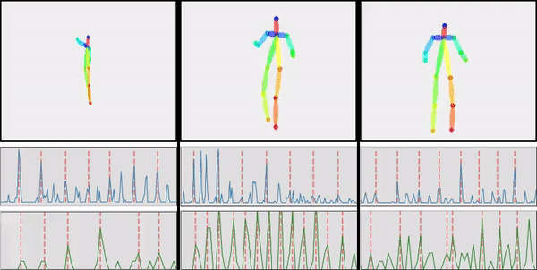
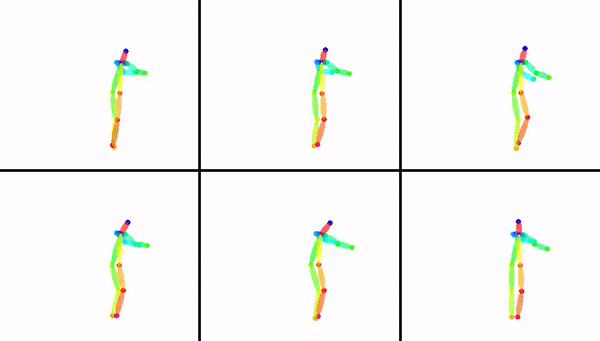
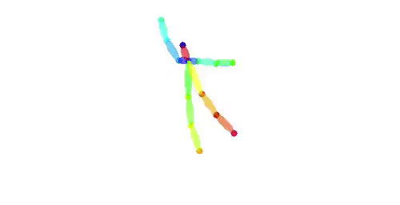
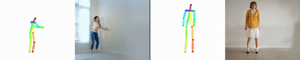

[](https://raw.githubusercontent.com/NVIDIA/FastPhotoStyle/master/LICENSE.md)


## Dancing to Music
Pytorch implementation for music-to-dance generation.

### License

Copyright (C) 2018 NVIDIA Corporation.  All rights reserved.
Licensed under the CC BY-NC-SA 4.0 license (https://creativecommons.org/licenses/by-nc-sa/4.0/legalcode).

### Paper 
[Hsin-Ying Lee](http://vllab.ucmerced.edu/hylee/), [Xiaodong Yang](https://xiaodongyang.org/), [Ming-Yu Liu](http://mingyuliu.net/), [Ting-Chun Wang](https://tcwang0509.github.io/), [Yu-Ding Lu](https://jonlu0602.github.io/), [Ming-Hsuan Yang](https://faculty.ucmerced.edu/mhyang/), and [Jan Kautz](http://jankautz.com/)  
[Dancing to Music]()  
In Neural Information Processing Systems (**NeurIPS**) 2019

### Results Video
For videos with audio, please visit our [youtube video](https://youtu.be/-e9USqfwZ4A)
- Generated Dance Sequences
second row: music beats; third row: kinematic beats
<p align='center'>
  
</p>

- Multimodality
Generation given same music and same initial poses
<p align='center'>
  
</p>

- Long Sequence
<p align='center'>
  
</p>

- Photo Realisitc Video
<p align='center'>
  
</p>


### Citation

If you find this code useful for your research, please cite our paper:

```
@inproceedings{lee2019dancing2music,
  title={Dancing to Music},
  author={Lee, Hsin-Ying and Yang, Xiaodong and Liu, Ming-Yu and Wang, Ting-Chun and Lu, Yu-Ding and Yang, Ming-Hsuan and Kautz, Jan},
  booktitle={NeurIPS},
  year={2019}
}
```

### Code Coming Soon

